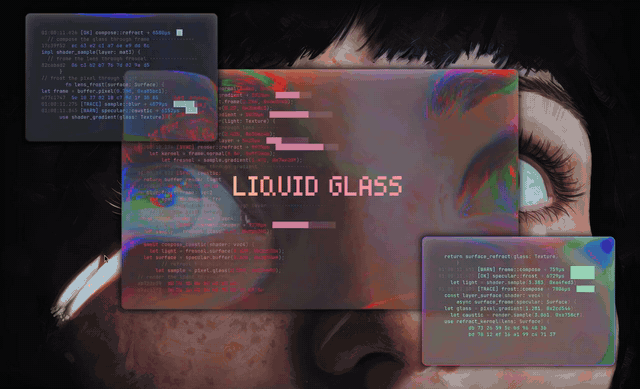

# Liquid Glass for Omarchy

Apple-style Liquid Glass for your terminal on [Omarchy](https://omarchy.org): thick glass edges that bend what's behind them, light that follows your cursor, parallax tilt, a slow oil-film shimmer, and windows that bend into existence, all tunable live with sliders.



[Watch the 20-second demo (MP4)](assets/demo.mp4)

## What you get

- **Glass terminals**: foot gets a see-through background, and the glass plugin turns what's behind it into frosted, refracting glass with a thick, curved rim.
- **Light that follows you**: a light source over your desktop lights each window's rim where it faces it. Move a window or your pointer and the highlight slides round the rim.
- **Parallax tilt**: the view behind the glass shifts as your cursor moves, like tilting thick glass.
- **Oil film**: slow iridescent swirls on the glass, like oil on water.
- **Click glow** and **materialize**: clicks energize the glass; new windows bend into existence.
- **Glass Tuner**: a small app with live sliders for all of it, named looks you can save and switch, and terminal text settings that follow your Omarchy theme.

It's built on [**HyprGlass**](https://github.com/hyprnux/hyprglass) by hyprnux, through the [**HyprGlass Liquid**](https://github.com/fasi96/hyprglass) fork that adds the motion.

## Requirements

- Dependencies: `hyprpm` (ships with Hyprland), `base-devel cmake meson cpio pkgconf git` (installed for you), `python3`, `jq`, `chromium` for the tuner window, `foot`.
- Omarchy with **Hyprland 0.56.2**. That's the tested version; others may not build yet.
- **foot** as your terminal (Omarchy's default). The glass shows through see-through windows, and Glass Tuner's terminal settings are for foot.
- A few minutes for `hyprpm` to build the plugin the first time. It asks for your password to install build tools and Hyprland headers.

## Install

**As an Omarchy plugin** (adds a glass button to your bar):

```bash
omarchy plugin add https://github.com/fasi96/omarchy-liquid-glass --enable
```

Click the new glass button on the bar. The first click opens a terminal that shows what Liquid Glass will change and asks before doing anything. After setup, the button opens Glass Tuner, and a right click turns the glass on and off. If a Hyprland update ever unloads the glass plugin, the button shows `!` and one click rebuilds it.

**Or with the script:**

```bash
git clone https://github.com/fasi96/omarchy-liquid-glass
cd omarchy-liquid-glass
./install.sh
```

Either way, open a **new terminal** afterwards, and press **Super+Ctrl+G** for Glass Tuner (or search "Glass Tuner" in the launcher).

Setup builds the plugin with `hyprpm`, which installs build tools and Hyprland headers, so it asks for your password and takes a few minutes the first time. Everything it adds to your config is fenced with `omarchy-liquid-glass` markers, and it backs up every file it touches to `~/.config/omarchy-liquid-glass/backup-<time>/`. If you already use upstream HyprGlass, it replaces it with the fork, since both provide the same plugin.

## Glass Tuner

| Section | What it's for |
|---|---|
| Thick glass rim | How wide and how strongly the glass edge bends, rainbow fringe, edge glow, top highlight |
| Glass body, Blur, Tone, Colour | Lens dome, blur, brightness and contrast, saturation, tint |
| Text | Brightens your theme's own text colour (still follows theme changes), font weight, bold-in-bright |
| Window look | Terminal transparency, padding, corner rounding, gaps, shadows |
| Outer line | A thin lit lip around windows (or the neon gradient) |
| Actions | Light follows you, Parallax tilt, Oil film, Click glow, Materialize, Drift. Each has its own on/off switch |

Changes show live; nothing sticks until you press **Save**. Use **Hold to compare** to see the glass off, **Open test window** to try it on a floating terminal, and **Saved looks** to keep several setups. The shipped look is saved as "Liquid Glass".

## Uninstall

```bash
./uninstall.sh            # removes everything it added; keeps your saved looks
./uninstall.sh --purge    # also deletes ~/.config/omarchy-liquid-glass
```

Installed as a plugin? Run the same script from the plugin folder, then remove the bar button:

```bash
~/.config/omarchy/plugins/io.github.fasi96.liquid-glass/uninstall.sh
omarchy plugin remove io.github.fasi96.liquid-glass
```

## After a Hyprland update

`hyprpm` rebuilds the plugin for the new Hyprland with `hyprpm update`. Until the fork has a build for that version, the glass is off, but nothing else breaks.

## Credits

- [HyprGlass](https://github.com/hyprnux/hyprglass) by hyprnux (BSD-3-Clause): the Liquid Glass shader and plugin this is built on.
- Motion design follows Apple's [Meet Liquid Glass](https://developer.apple.com/videos/play/wwdc2025/219/) (WWDC25): light and movement come from what you do.

This package (installer + Glass Tuner) is MIT-licensed. The plugin keeps HyprGlass's BSD-3-Clause license.
